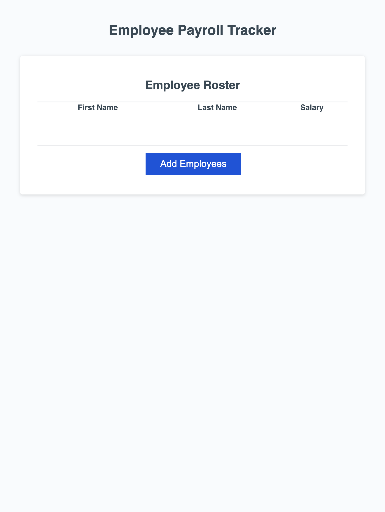

# Module-03-Challenge
Take starter code and implement Javascript to enter employee information.

## Sources
I used the starter coder provided to me by the EdX bootcamp.

## Challenges
It took me a while to figure out how to output the input information as an array in the collectEmployees function. I had to play around with where to put the variables to have it read correctly. 

Additionally, it took me a bit too long to realize that I needed to convert salary to a number in order to have it communicate correctly with the rest of the file. 

## Features
When the user clicks on the "Add Employees" button, the website prompts the user to enter information about employees. Then the information displays on a table in alphabetical order. Also, the average salary will display in the console along with a randomly drawn employee.

[Webpage](https://skylerrhys.github.io/Module-03-Challenge/)

